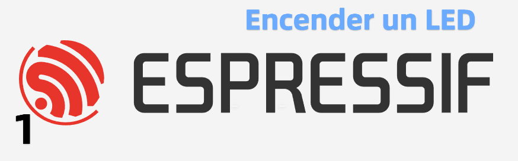
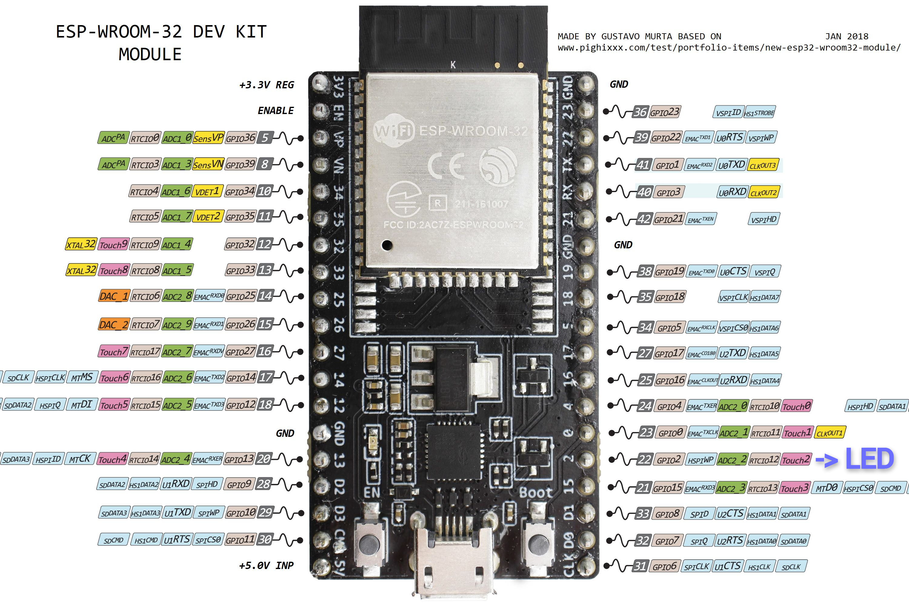

# Curso de programacion del ESP32 mediante ESP-IDF

## 01 - Encender un led.

En este simple ejemplo  programo un parpadeo de led con un periodo de  1 segundo.

## Placa utilizada ESP32 -WROOM

En esta placa el led esta conectado a `GPIO_2`.

